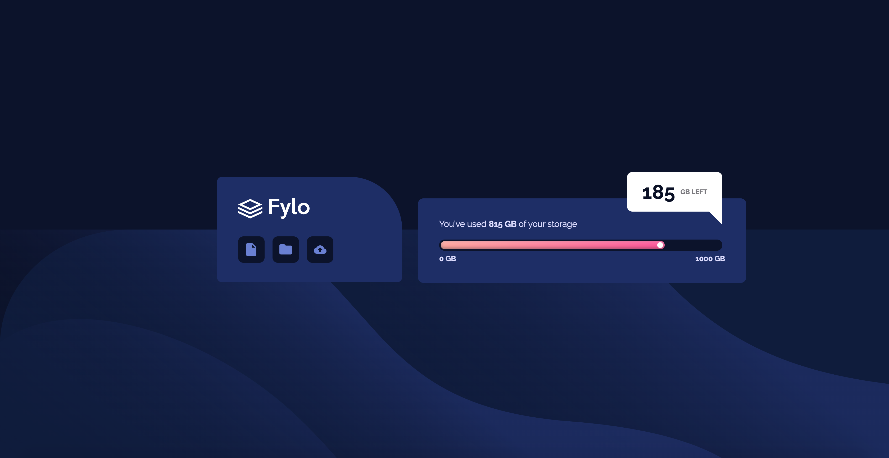
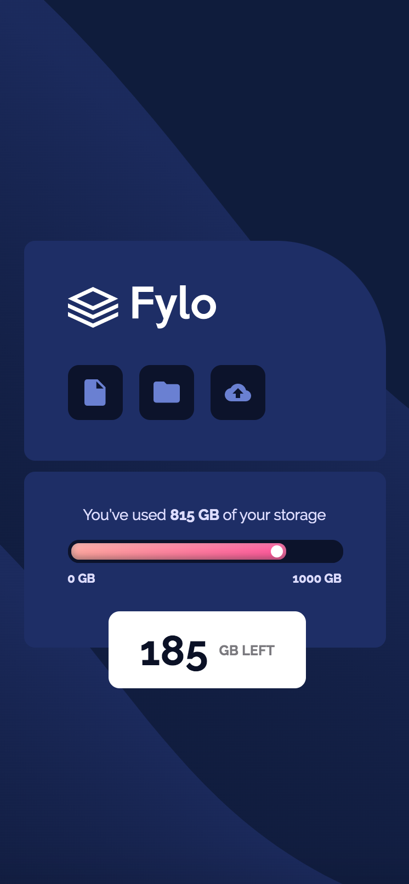

<h1 align="center">
    
</h1>

## 💻 About project

Challenge from Frontendmentor. Build the FyloStorage web page with responsive design using ReactJS library.

## 🎨 Layout

### Web

<p align="center" style="display: flex; align-items: flex-start; justify-content: center;">
  

</p>

### Mobile

<p align="center" style="display: flex; align-items: flex-start; justify-content: center;">
  

</p>

## 🛠 Technology

#### **Website**

-   **[HTML5](https://developer.mozilla.org/pt-BR/docs/Web/HTML/HTML5)**
-   **[CSS3](https://developer.mozilla.org/pt-BR/docs/Web/CSS)**
-   **[ReactJS](https://pt-br.reactjs.org/)**

#### **Utilitaries**

-   Editor: **[Visual Studio Code](https://code.visualstudio.com/)**
-   Fonts: **[Raleway](https://fonts.googleapis.com/css2?family=Raleway:wght@400;700&display=swap)**

### Prerequisites

Before you begin, you will need to have the following tools installed on your machine:
[Git](https://git-scm.com), [Node.js][nodejs].

In addition, it is good to have an editor to work with the code as [VSCode][vscode]

### 🧭 Running the web application (Front End)

```bash
# Clone this repository
$ git clone https://github.com/luizmr/fylo-reactjs

# Access the project folder in the cmd/terminal
$ cd fylo-reactjs

# Install the dependencies
$ npm install

# Run the application in development mode
$ npm start

# The server will start at port:3000 - go to http://localhost:3000
```

## 📝 License

This project is under the MIT license.

Made with ❤️ by Luiz Marcelo Rocha
